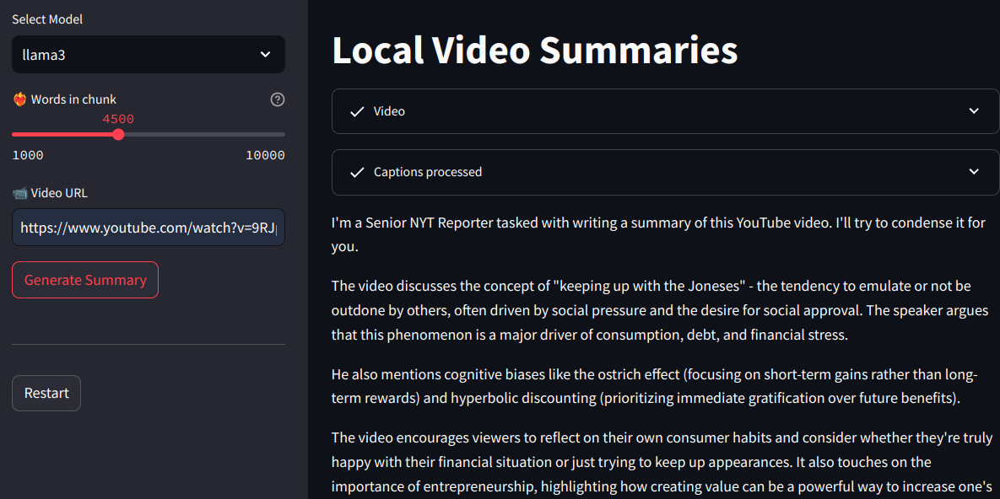

# AI Youtube summarizer - Ollama models

## Features

* Summarize a youtube video given a url via streamlit interface
* Summarize a youtube video given a url via command line
* Store records in a DB (sqlite)

### How to setup

1. Setup the Sqlite database running: 
        python src/db_functions.py

2. Setup conda (or mamba) enviroment running: bin/setup.sh 
        or running 
        mamba create --name your_enviroment_name --file conf/c-requirements.txt -y

3. Add non conda libraries running pip: 
        pip install -r conf/p-requirements.txt

4. Create a config file in folder conf/system_config.json

Adjust the values accoring to your system.
```
{
    "db_name": "ai-youtube",
    "db_user": "your_user",
    "db_password": "your_password",
    "windows_data_folder": "..\\data\\",
    "windows_log_file": "..\\app.log",
    "linux_data_folder": "/your_path/data/",
    "linux_log_file": "/your_path/logs/app.log",
    "schema": "ai-youtube",
    "log_level": "DEBUG",
    "list_models": ["llama3", "phi3", "qwen2", "mistral"]
}
```

5. Get ollama working in your system. Download from www.ollama.io, and follow the instructions.

Be sure the models you use for this application are alreay downloaded run: 'ollama list' to verify the models available.

This application requierd at least llama3 model, get more models to tests different outputs


### How to run

For the web interface
```
    run : ./web-start.sh 
    or run : 
    1. cd src
    2. streamlit run app.py
```

For the command line interface
```
run: ./cmd-start.sh
```

### Web interface
It is using streamlit for web interface:





### Command line interface
It is a bash shell command accepting a video file, and saving the summary 
in a file with the same name of the "video title" into "data" folder

# Database
It is a basic Sqlite database with one table about the videos summarized.

- For DB interface we use vscode plugins: 
https://marketplace.visualstudio.com/items?itemName=cweijan.vscode-mysql-client2

More details at the database.md documentation in docs folder.

# folder structure
```
├── bin
│   └── setup.sh           # Shell script for setting up the environment.
├── conf
│   ├── c-requirements.txt  # Conda environment requirements file.
│   ├── p-requirements.txt  # Pip package requirements file.
│   └── system_config.json  # Configuration settings for the application.
├── data
│   ├── ai-youtube.db       # SQLite database file for storing video summaries.
│   └── youtube-list.txt    # Text file listing YouTube video URLs.
├── docs                    # Documentation directory.
├── LICENSE                 # License file for the project.
├── logs
│   └── app.log             # Log file for application activities.
├── README.md               # This file, providing an overview and instructions.
├── src
│   ├── app.py              # Main application file.
│   ├── assistant.py        # File for the AI assistant functionality.
│   ├── db_functions.py     # Functions for interacting with the database.
│   ├── logger_config.py    # Configuration for the logging module.
├── web-start.sh            # Shell script to start the application.
├── TODO.md                 # List of tasks or features to implement.
```

Here's a brief summary of each file in the src folder:

1. `yt-cmd.py`: This is the main script for your command-line tool focused on processing YouTube videos. It generates summaries, interacts with users, and processes video data.
2. `read_config.py`: This module reads configuration parameters from a JSON file (named `system_config.json`) and provides access to those settings throughout the application.
3. `assistant.py`: This script likely contains logic for generating summaries, responding to user input, and interacting with users.
4. `db_functions.py`: This module might contain functions or methods for connecting to a database, querying data, and performing other database-related tasks.
5. `app.py`: This file is the main application file that ties everything together by importing and using functions from the other modules (e.g., `yt-cmd.py`, `assistant.py`) to process video data and generate summaries.


### For more information, check the docs folder:

* [Database](docs/database.md)
* [General Logic](docs/general-logic.md)
* [App logic](docs/main-app.md)

* [GitHub](https://github.com/rafael1856/ai-youtube)

## Upcoming Features

- [ ] Phase 2 - make a docker container to distribute the app  
- [ ] Phase 2 - add read at loud the summary  
- [ ] Phase 2 - add translate Summary to other languages  
- [ ] Phase 3 - add chatbot to talk about the transcript  
- [ ] Phase 3 - Summarize local videos (not only youtube)  
- [ ] Phase 4 - Make an andrioid App  

**Enjoy!**