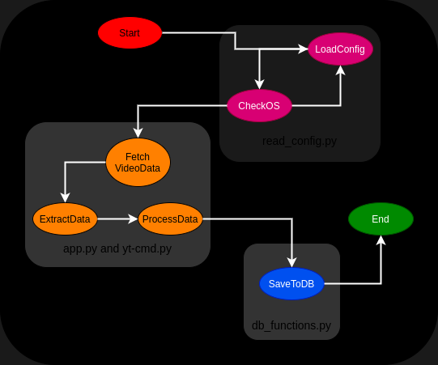

The logic for processing videos in this project involves several steps, including reading configuration settings, interacting with a database, and possibly manipulating video data. This is the general workflow :

1. **Configuration Loading ([`read_config.py`]:**
   - The script `read_config.py` is responsible for loading configuration settings from a JSON file named `system_config.json`. This configuration likely includes paths and settings essential for the application's operation, such as data folders and log file paths.
   - It checks the operating system to determine the correct data folder and log file paths to use. This allows the application to work on both Windows `nt` and POSIX-compliant systems (Linux/Unix).

2. **Database Interaction (`db_functions.py`):**
   - The `db_functions.py` file, as mentioned in the error traceback, seems to handle database operations, including saving video information. This suggests that the application stores video metadata, possibly including URLs, titles, captions, transcripts, and summaries, in a database.
   - An error related to database connection (`'NoneType' object has no attribute 'cursor'`) indicates that the application attempts to interact with a SQLite database but encounters issues when the database file cannot be opened or the connection is not properly established.

3. **Video Processing Logic: (`app.py and yt-cmd.py`)**
   - While the specific video processing logic is not detailed in the provided excerpts, the mention of functions like `save_video_info` suggests that the application fetches video data (metadata, captions, transcripts, summaries) and stores this information in a database.
   - The application might be using external APIs or libraries to fetch video details and perform operations like generating summaries or extracting transcripts. This is hinted at by the presence of a parameter named `llm_model`, which could refer to a language model used for processing video transcripts or summaries.

{: .center }