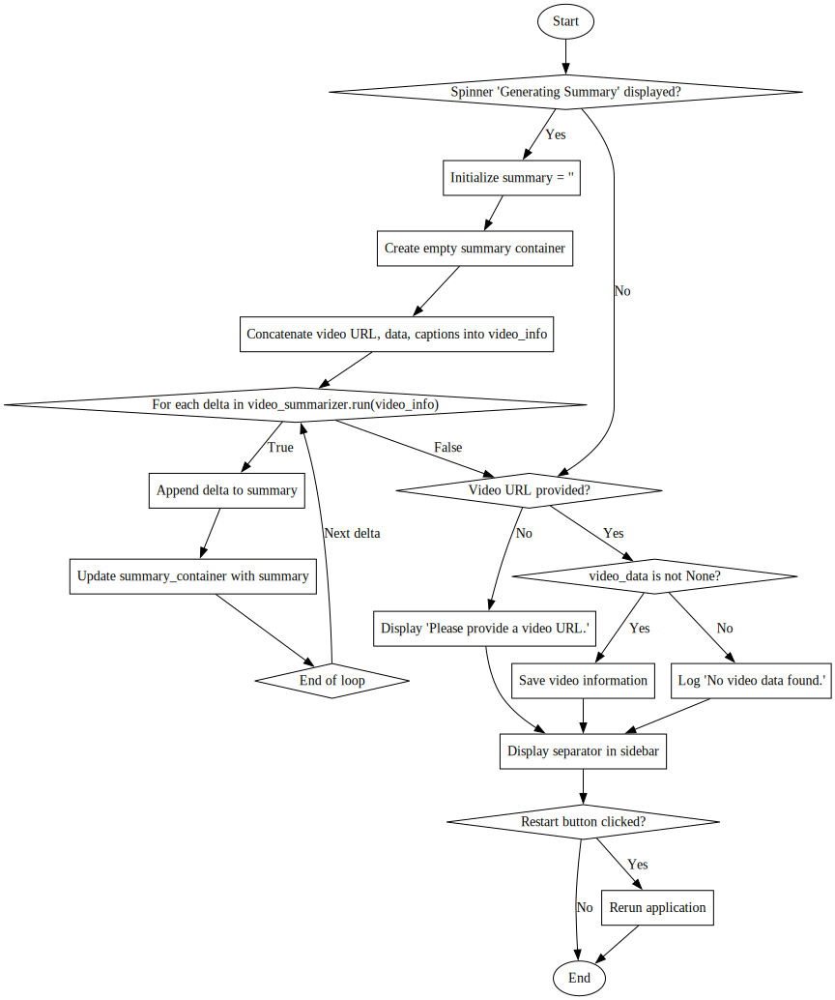

Here's a step-by-step explanation of the main function's logic:

1. **Chunker Limit Configuration**: 
   - A slider is presented in the sidebar for the user to set the "Words in chunk" limit. This determines how many characters to chunk the text into for processing. The slider ranges from 1000 to 10000, with a default value of 4500 and increments of 500. A help tooltip provides additional information.

2. **Video URL Input**:
   - A text input field is provided in the sidebar for the user to enter a YouTube video URL. The entered URL is logged for debugging purposes.

3. **Generate Summary Button**:
   - A button labeled "Generate Summary" is placed in the sidebar. When clicked, it triggers the summary generation process by storing the entered video URL in the session state under the key `"youtube_url"`.

4. **Video Data Initialization**:
   - A variable `video_data` is initialized as `None`, indicating that at this point, no video data has been fetched or processed.

5. **Video URL Processing**:
   - If the session state contains a key `"youtube_url"`, indicating that a URL has been entered and the "Generate Summary" button has been clicked, the application proceeds to process the video URL.
   - An instance of `YouTubeTools` is created to handle YouTube-related operations.
   - The variable `video_captions`is initialized as `None`, preparing to store the video's captions.
   - A summarizer function is selected based on the model chosen by the user stored in `llm_model`, and its reference is logged.
   - A status message "Parsing Video" is displayed to inform the user that the video is being processed. This is done within a `with` block that ensures the status message is properly managed.

6. **Video Embedding and Data Display**:
   - Inside a container, an empty placeholder `video_container` is created to display the video. The video is embedded using the `.video()` method with the URL from the session state.
   - The video data is fetched using `youtube_tools.get_youtube_video_data(_url)` and displayed in another container as JSON. This allows the user to see the raw data associated with the YouTube video.

7. **Captions Fetching and Logging**:
   - A new status message "Reading Captions" is shown while the application fetches the video's captions using `youtube_tools.get_youtube_video_captions(_url)`.
   - The fetched captions are stored in `video_captions`, and a debug log message is created to log the first 300 characters of the captions for debugging purposes.

This logic outlines the initial steps in a process to generate summaries for YouTube videos, focusing on user input handling, video data fetching, and preliminary processing.